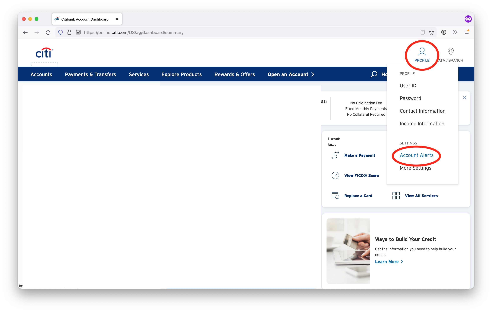
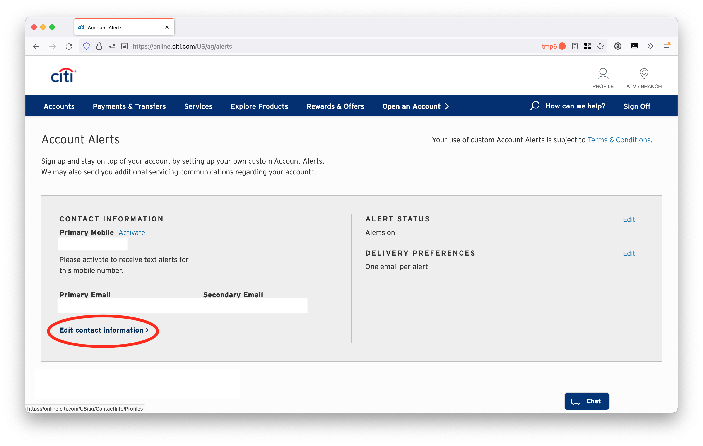
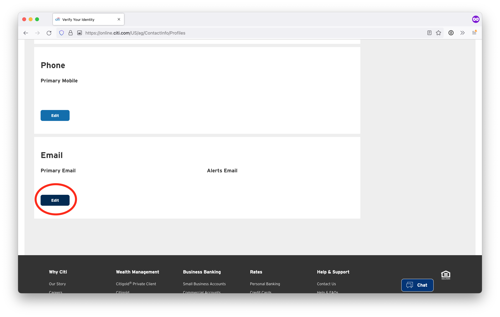
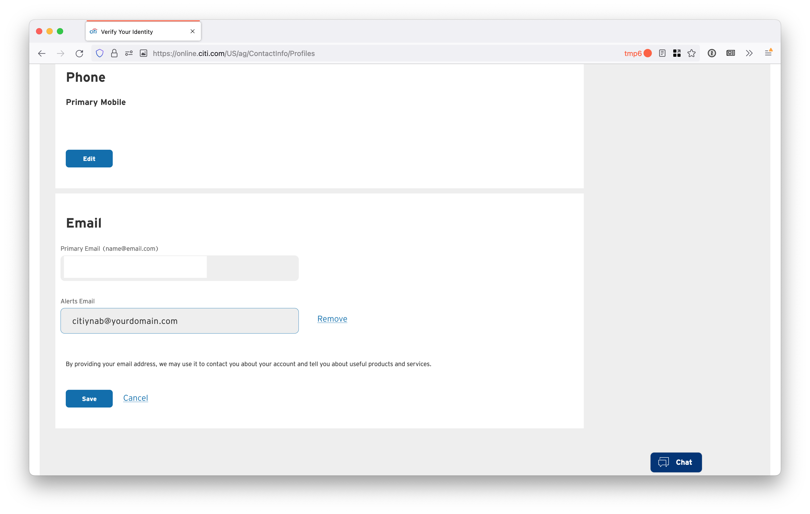
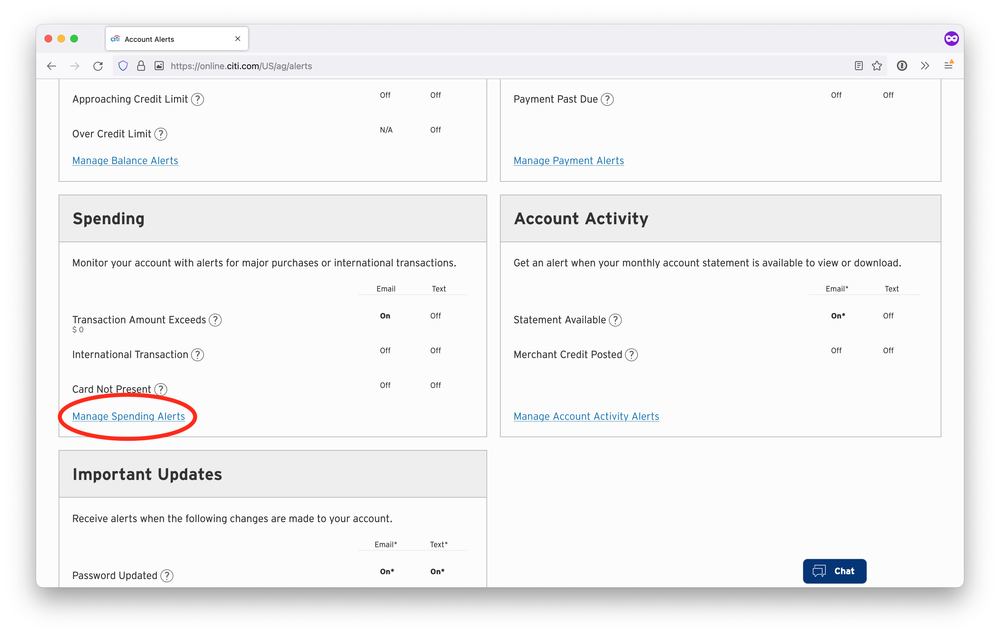
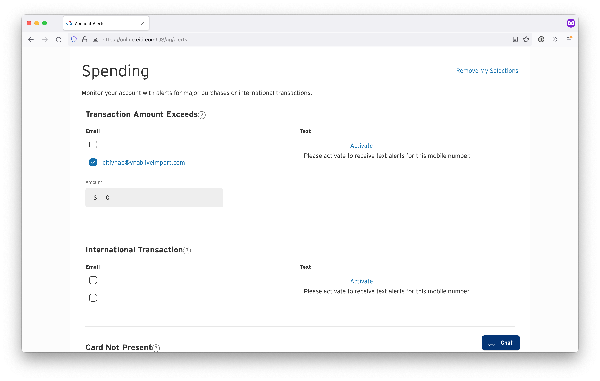

# Citi

Log into citi.com and click "Profile" in the top-right corner and then click "Account Alerts"

Click "Edit contact information"

Scroll down to Email and click "Edit"

For the "Alerts Email" box, enter "citiynab@yourdomain.com", but replace "yourdomain" with the domain you set up with Simple Email Service. Click "Save"

Go back by clicking "Profile" and then "Account Alerts" again. Scroll down to the section labeled "Spending" and click "Manage Spending Alerts"

Under "Transaction Amount Exceeds" check the box next to your alerts email and enter "$0" in the "Amount" box. Scroll down and click "Save"

