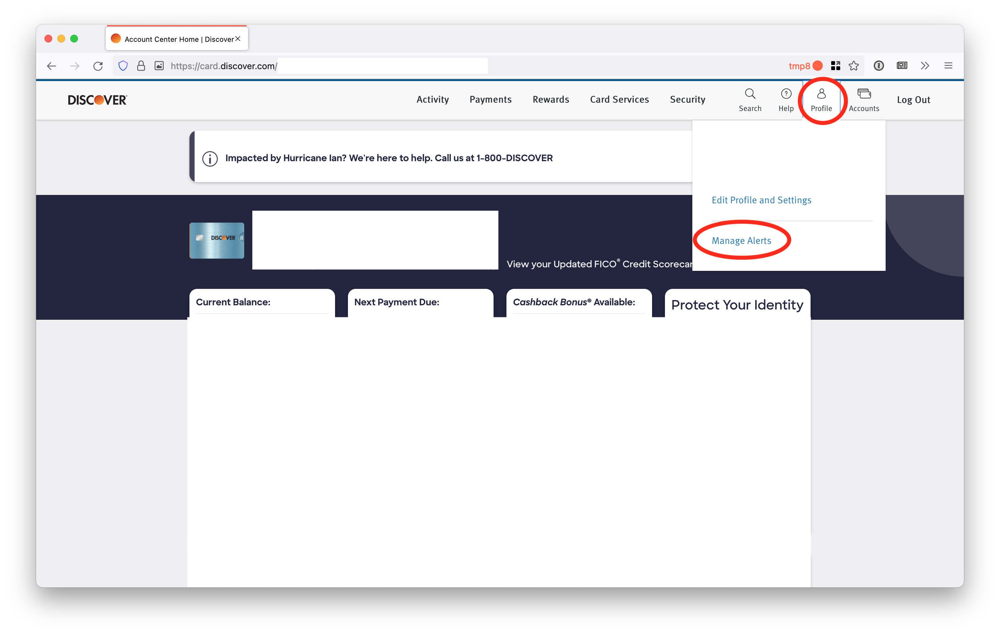
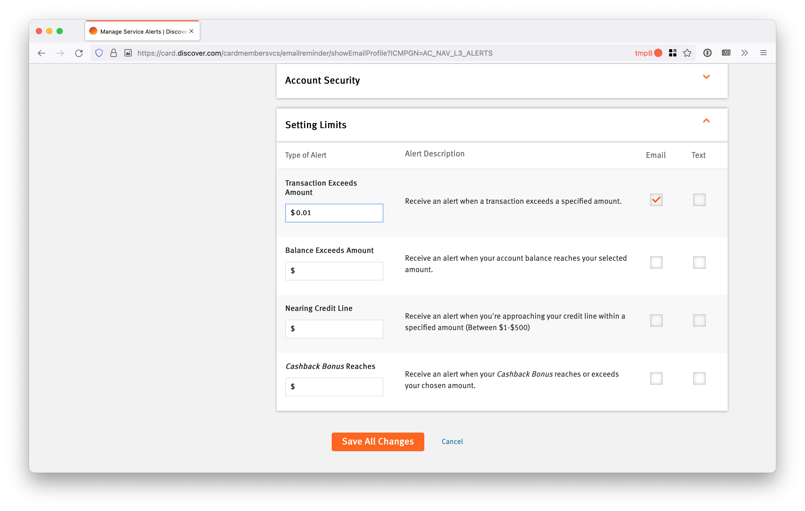

# Discover

Unfortunately Discover doesn't let you add a separate email address specifically for transaction notifications. You'll need to have them sent to your regular email address and then forward them to “discoverynab@yourdomain.com”, but replacing “yourdomain” with the domain name you verified with Simple Email Service.

Continue reading this document for instructions on setting up notifications with Discover and then read these [email forwarding instructions](/docs/email_forwarding/email_forwarding.md). When setting up email forwarding rules, you can expect the transaction emails to be from discover@services.discover.com with subject "Transaction Alert".

Login to your account at Discover.com

Click "Profile" in the top-right corner and then click "Manage Alerts".

Scroll down to the section titled "Setting Limits" and enter "$0.01" in the box labeled "Transaction Exceeds Amount". Click the checkbox in the "Email" column. Finally, click "Save All Changes".

