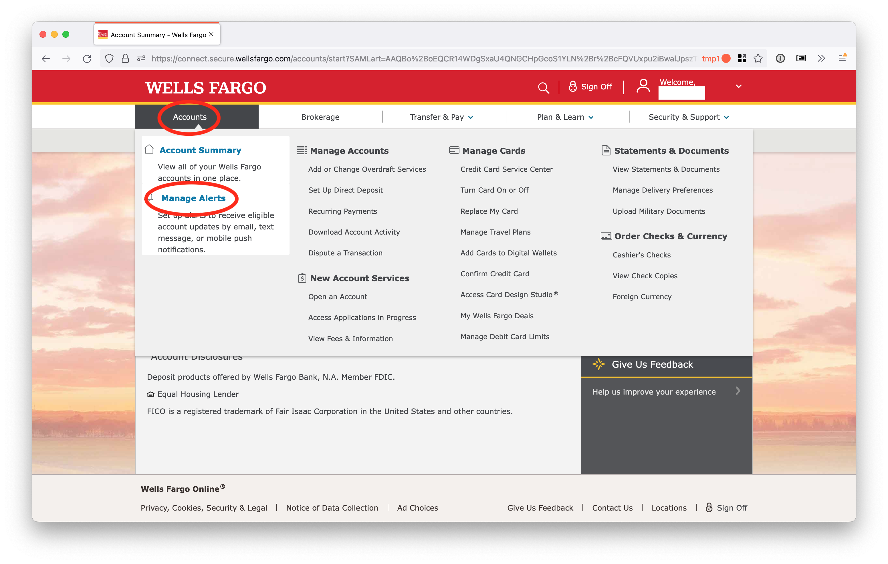
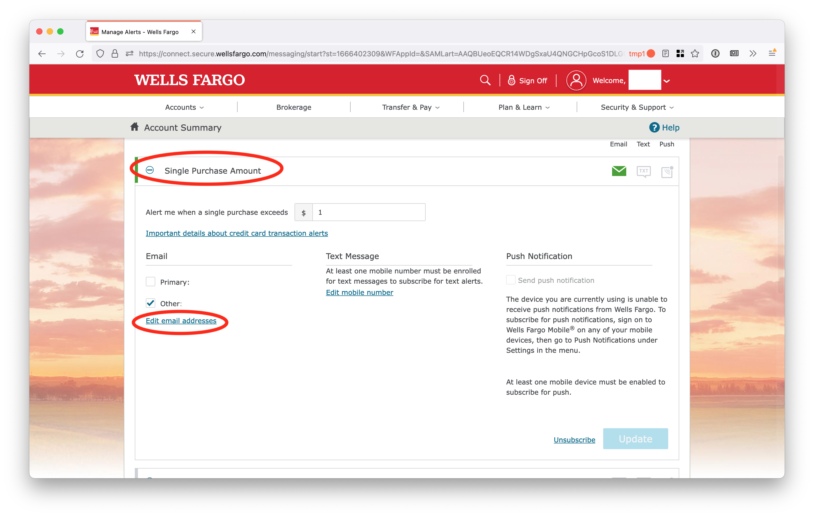
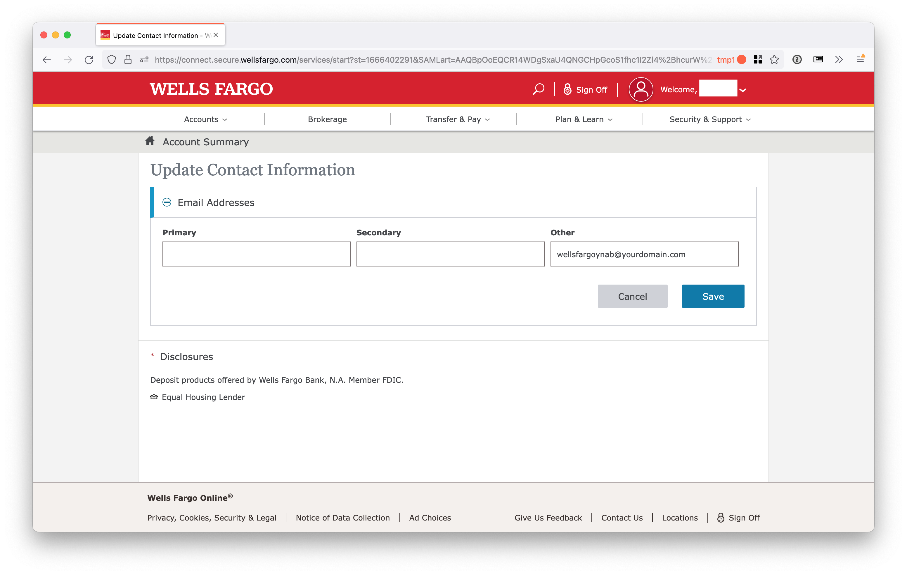
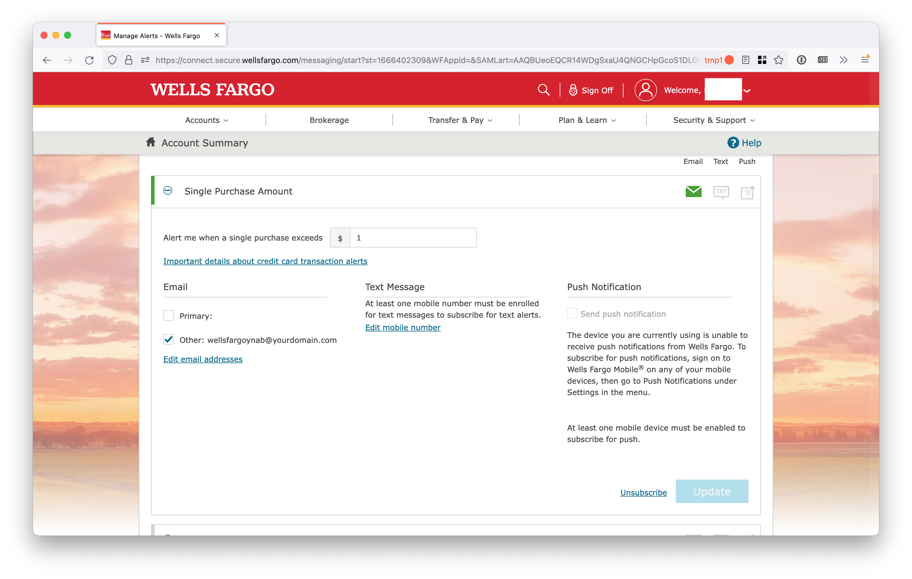

# Wells Fargo

Log into your account on wellsfargo.com and click "Accounts" and then "Manage Alerts"

Scroll down and click "Single Purchase Amount" and then "Edit email addresses"

In the "Other" box, add "wellsfargoynab@yourdomain.com", but replace "yourdomain.com" with the domain you set up with Simple Email Service. Click "Save"

Go back by clicking "Accounts" and then "Manage Alerts" again. Under "Single Purchase Amount", enter "$1" in the box and check the "Other" email box. Click "Update"

