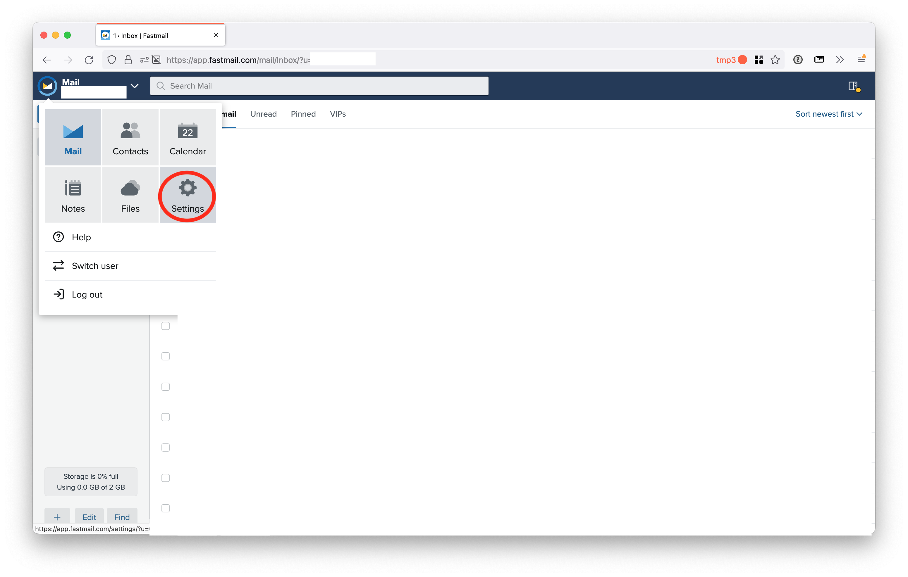
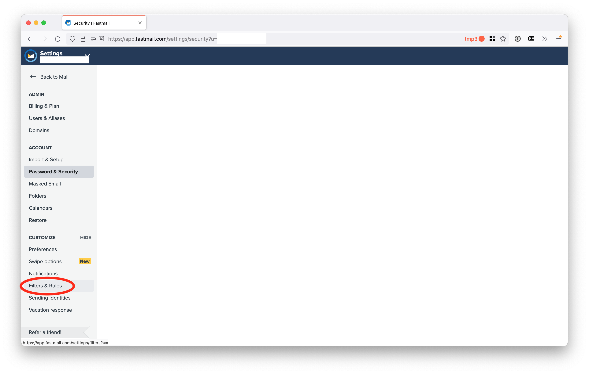
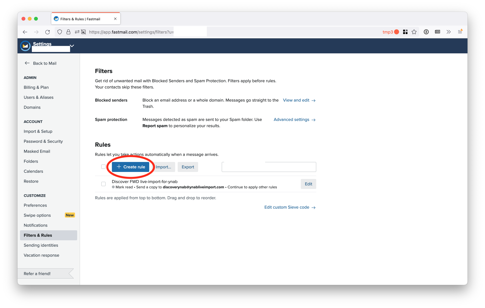
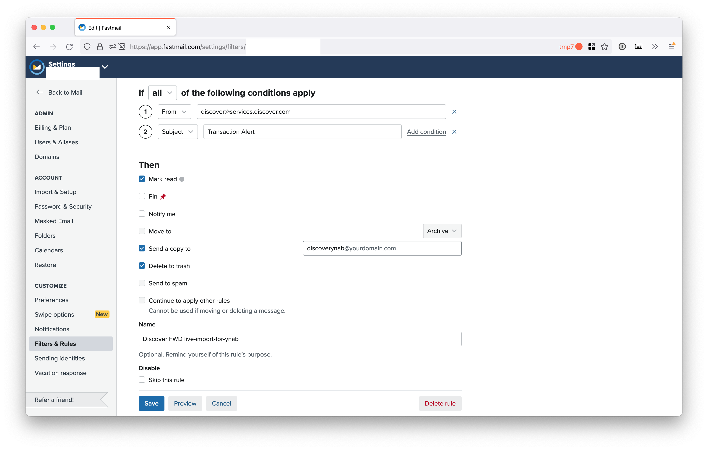

# Fastmail

Log in to your Fastmail account. Click the dropdown on the top-left corner and then click "Settings".

Click "Filters & Rules"

Click "Create Rule"

Fill out the rule according to whichever bank you are setting up. Check the boxes "Mark read", "Send a copy to", and "Delete to trash".

In the "Send a copy to" box, enter the live-import-for-ynab email address for this bank with the domain you set up with Simple Email Service.

Click "Save"

This example image shows the correct set up for Discover.

Repeat these steps for each bank you are setting up that requires email forwarding.